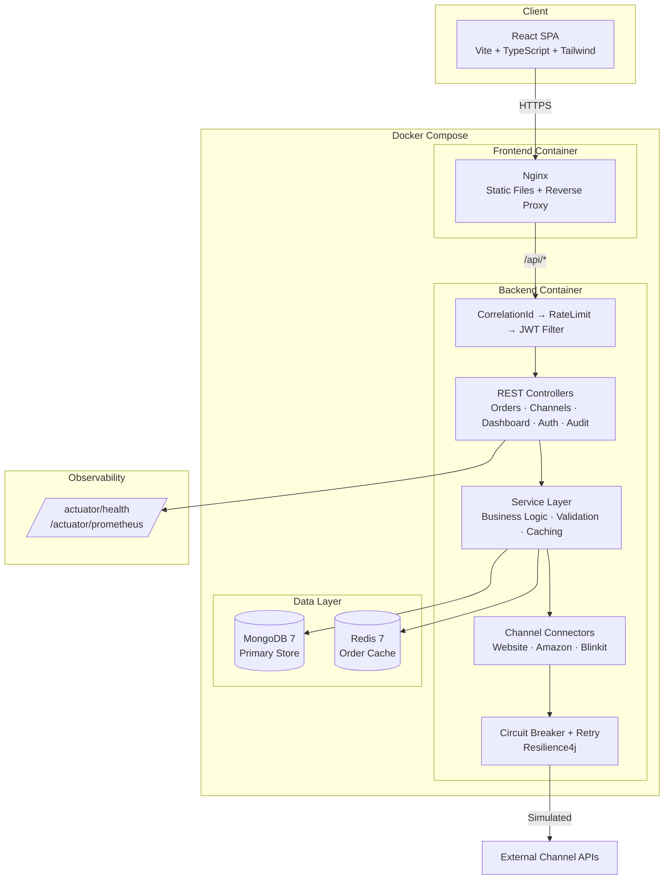
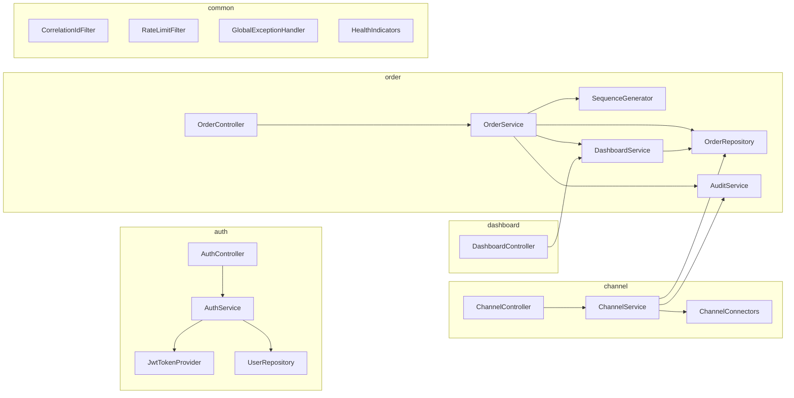

# Commerce Platform — Technical Documentation

## Admin CRM Portal for Multi-Channel Order Management

**Date**: February 2026  
**Repository**: commerce-platform

---

## Table of Contents

1. [Executive Summary](#1-executive-summary)
2. [System Architecture](#2-system-architecture)
3. [Technology Stack](#3-technology-stack)
4. [Database Schema Design](#4-database-schema-design)
5. [API Contract & Endpoints](#5-api-contract--endpoints)
6. [Authentication & Authorization](#6-authentication--authorization)
7. [Data Flow & Order Lifecycle](#7-data-flow--order-lifecycle)
8. [System Resilience & Hardening](#8-system-resilience--hardening)
9. [Initialization & Lifecycle Management](#9-initialization--lifecycle-management)
10. [Performance & Caching Strategy](#10-performance--caching-strategy)
11. [Security Hardening](#11-security-hardening)
12. [Monitoring & Observability](#12-monitoring--observability)
13. [Load Testing & Performance Results](#13-load-testing--performance-results)
14. [Containerization & Deployment](#14-containerization--deployment)
15. [Frontend Architecture](#15-frontend-architecture)
16. [Development & Setup Guide](#16-development--setup-guide)
17. [Assumptions & Trade-offs](#17-assumptions--trade-offs)
18. [AI Tools Usage](#18-ai-tools-usage)

---

## 1. Executive Summary

The Commerce Platform is an **admin CRM portal** that aggregates and manages customer orders from multiple e-commerce sales channels — **Organic Website**, **Amazon**, and **Blinkit**. It provides a unified dashboard for order management, real-time channel health monitoring, and comprehensive audit logging.

**Key Capabilities:**
- Multi-platform order aggregation from 3 sales channels
- Order management dashboard with filtering, sorting, search, and pagination
- Order status tracking with full timeline and audit trail
- Role-based access control (ADMIN, MANAGER, VIEWER)
- Production-grade resilience with circuit breakers, retry, and rate limiting
- Containerized deployment with Docker Compose

---

## 2. System Architecture

### Architecture Pattern: Modular Monolith

The application follows a **modular monolith** architecture — a single deployable unit with clearly separated domain modules. This was chosen over microservices due to the 48-hour delivery constraint while maintaining clean boundaries for future decomposition.

### Architecture Diagram



### Component Diagram



### Module Structure

| Module | Responsibility |
|--------|----------------|
| `auth` | JWT authentication, login, register, token refresh |
| `user` | User model, repository, role management |
| `order` | Order CRUD, status transitions, validation, timeline |
| `channel` | Channel connectors (Website, Amazon, Blinkit), order sync |
| `dashboard` | Aggregated statistics, channel breakdown |
| `audit` | Audit logging for all entity mutations |
| `config` | Security, CORS, cache, MongoDB, Redis, Swagger, shutdown |
| `common` | DTOs, exceptions, filters, health indicators, utilities |

### Layered Architecture

```
HTTP Request
    ↓
CorrelationIdFilter → RateLimitFilter → JwtAuthenticationFilter
    ↓
SecurityFilterChain (authorization check)
    ↓
REST Controller (request/response mapping, @PreAuthorize)
    ↓
Service Layer (business logic, validation, caching)
    ↓
Repository / MongoTemplate (data access)
    ↓
MongoDB (persistence) ←→ Redis (order cache)
```

### Service Interaction

```
OrderController → OrderService → OrderRepository
                                → DashboardService (cache invalidation)
                                → AuditService (async audit logging)
                                → SequenceGenerator (order number generation)

ChannelController → ChannelService → ChannelConnectors (with CircuitBreaker + Retry)
                                   → OrderRepository
                                   → DashboardService
                                   → AuditService
                                   → SequenceGenerator

DashboardController → DashboardService → OrderRepository (with in-memory cache)
```

---

## 3. Technology Stack

| Layer | Technology | Version | Rationale |
|-------|------------|---------|-----------|
| **Runtime** | Java | 21 (LTS) | Virtual threads, pattern matching, modern language features |
| **Backend Framework** | Spring Boot | 3.2.4 | Production-ready, mature ecosystem |
| **Database** | MongoDB | 7 | Flexible schema for varied channel metadata, embedded documents |
| **Cache** | Redis | 7 | Distributed order caching with TTL |
| **Frontend** | React + TypeScript | 18 + 5 | Type-safe, component-based UI |
| **Build Tool (FE)** | Vite | 5 | Fast HMR, optimized builds |
| **Styling** | Tailwind CSS | 3 | Utility-first, rapid UI development |
| **Charts** | Recharts | 2 | React-native charting library |
| **Auth** | JWT (jjwt) | 0.12.5 | Stateless, scalable authentication |
| **API Docs** | SpringDoc OpenAPI | 2.4.0 | Auto-generated Swagger UI |
| **Resilience** | Resilience4j | 2.2.0 | Circuit breaker, retry, rate limiter |
| **Rate Limiting** | Bucket4j | 8.7.0 | Token bucket algorithm, per-IP |
| **Metrics** | Micrometer + Prometheus | Built-in | Industry-standard monitoring |
| **Containerization** | Docker + Docker Compose | Latest | Multi-service orchestration |
| **Load Testing** | k6 | Latest | Scriptable, modern load testing |

---

## 4. Database Schema Design

### Collection: `users`

| Field | Type | Constraints | Description |
|-------|------|-------------|-------------|
| `_id` | ObjectId | PK | Auto-generated |
| `email` | String | Unique index | Login identifier |
| `passwordHash` | String | Not null | BCrypt(12) hashed |
| `name` | String | Not null | Display name |
| `role` | Enum | ADMIN, MANAGER, VIEWER | Access level |
| `active` | Boolean | Default: true | Account status |
| `createdAt` | LocalDateTime | Auto | Spring Data audit |
| `updatedAt` | LocalDateTime | Auto | Spring Data audit |

### Collection: `orders`

| Field | Type | Constraints | Description |
|-------|------|-------------|-------------|
| `_id` | ObjectId | PK | Auto-generated |
| `orderNumber` | String | Unique index | Format: ORD-{CHN}-{SEQ} |
| `channel` | String | Indexed | WEBSITE, AMAZON, BLINKIT |
| `channelOrderRef` | String | | External platform reference |
| `customer` | Embedded | | { name, email, phone } |
| `items` | Embedded[] | | [{ productName, sku, quantity, unitPrice, totalPrice }] |
| `status` | OrderStatus | Indexed | PENDING → CONFIRMED → ... → DELIVERED |
| `totalAmount` | BigDecimal | | Sum of item totals |
| `shippingAddress` | Embedded | | { line1, line2, city, state, pincode, country } |
| `channelMetadata` | Map | | Channel-specific data (e.g., primeOrder, darkStoreId) |
| `timeline` | Embedded[] | | [{ status, changedBy, notes, timestamp }] |
| `placedAt` | LocalDateTime | Indexed DESC | Order placement time |
| `createdAt` | LocalDateTime | Auto | |
| `updatedAt` | LocalDateTime | Auto | |

**Compound Indexes:**
- `(channel, status, placedAt)` — Optimizes filtered dashboard queries
- Text index on `(customer.name, orderNumber, channelOrderRef)` — Full-text search

### Collection: `channels`

| Field | Type | Constraints | Description |
|-------|------|-------------|-------------|
| `_id` | ObjectId | PK | |
| `name` | String | | Display name |
| `code` | ChannelCode | Unique index | WEBSITE, AMAZON, BLINKIT |
| `status` | ChannelStatus | | ACTIVE, INACTIVE |
| `description` | String | | Channel description |
| `logoUrl` | String | | Channel logo path |
| `apiConfig` | Map | | API configuration (baseUrl, version, etc.) |

### Collection: `audit_logs`

| Field | Type | Constraints | Description |
|-------|------|-------------|-------------|
| `_id` | ObjectId | PK | |
| `userId` | String | | Acting user ID |
| `userName` | String | | Acting user name |
| `action` | String | | CREATE_ORDER, UPDATE_ORDER_STATUS, CHANNEL_SYNC |
| `entityType` | String | Compound index | ORDER, Channel |
| `entityId` | String | Compound index | Target entity ID |
| `details` | Map | | Action-specific payload |
| `ipAddress` | String | | Client IP (optional) |
| `createdAt` | LocalDateTime | Indexed DESC | |

### Collection: `counters`

| Field | Type | Description |
|-------|------|-------------|
| `_id` | String | Sequence name (e.g., "order_sequence") |
| `seq` | Long | Current counter value, atomically incremented |

Uses MongoDB `findAndModify` with `$inc` and `upsert: true` for atomic, restart-safe sequence generation.

---

## 5. API Contract & Endpoints

### Response Wrapper

All API responses use a consistent `ApiResponse<T>` envelope:

```json
{
  "success": true,
  "message": "Optional message",
  "data": { ... },
  "errors": null,
  "timestamp": "2026-02-27T12:00:00"
}
```

Error responses include field-level validation errors:

```json
{
  "success": false,
  "message": "Validation failed",
  "errors": {
    "email": "must not be blank",
    "password": "must be at least 6 characters"
  }
}
```

### Pagination

List endpoints return `PageResponse<T>`:

```json
{
  "content": [ ... ],
  "page": 0,
  "size": 20,
  "totalElements": 150,
  "totalPages": 8,
  "first": true,
  "last": false
}
```

### Endpoint Reference

| Method | Path | Auth | Role | Description |
|--------|------|------|------|-------------|
| POST | `/api/auth/login` | No | — | Login, returns JWT tokens |
| POST | `/api/auth/register` | Yes | ADMIN | Register new user |
| POST | `/api/auth/refresh` | No | — | Refresh access token |
| GET | `/api/auth/me` | Yes | Any | Current user info |
| GET | `/api/orders` | Yes | Any | List orders (filter, sort, search, paginate) |
| GET | `/api/orders/{id}` | Yes | Any | Get order by ID (Redis cached) |
| GET | `/api/orders/number/{orderNumber}` | Yes | Any | Get order by order number |
| POST | `/api/orders` | Yes | ADMIN, MANAGER | Create a new order |
| PATCH | `/api/orders/{id}/status` | Yes | ADMIN, MANAGER | Update order status |
| GET | `/api/channels` | Yes | Any | List all channels |
| GET | `/api/channels/{code}` | Yes | Any | Get channel by code |
| POST | `/api/channels/{code}/sync` | Yes | ADMIN, MANAGER | Sync orders from channel |
| GET | `/api/dashboard/stats` | Yes | Any | Dashboard statistics |
| GET | `/api/audit` | Yes | ADMIN | List audit logs (paginated) |
| GET | `/api/audit/entity/{type}/{id}` | Yes | ADMIN | Audit logs for specific entity |
| GET | `/actuator/health` | No | — | Application health |
| GET | `/actuator/prometheus` | No | — | Prometheus metrics |

### Order Filtering Parameters

| Parameter | Type | Description |
|-----------|------|-------------|
| `page` | int | Page number (default: 0) |
| `size` | int | Page size (default: 20, max: 100) |
| `sort` | string | Sort field (default: placedAt) |
| `direction` | string | ASC or DESC (default: DESC) |
| `channel` | string | Filter by channel (WEBSITE, AMAZON, BLINKIT) |
| `status` | string | Filter by status |
| `search` | string | Search order number, customer name/email |
| `startDate` | ISO datetime | Filter orders placed after |
| `endDate` | ISO datetime | Filter orders placed before |

---

## 6. Authentication & Authorization

### JWT Auth Flow

```
1. POST /api/auth/login { email, password }
   → Validates credentials against MongoDB (BCrypt)
   → Returns { accessToken (1h TTL), refreshToken (24h TTL) }

2. Authenticated requests:
   Authorization: Bearer <accessToken>
   → JwtAuthenticationFilter extracts + validates token
   → Sets SecurityContext with user details + role

3. Token refresh:
   POST /api/auth/refresh { refreshToken }
   → Validates refresh token
   → Returns new accessToken + refreshToken pair
```

### Role-Based Access Control (RBAC)

| Role | Orders | Channels | Dashboard | Audit | Users |
|------|--------|----------|-----------|-------|-------|
| **ADMIN** | Read, Create, Update | Read, Sync | Read | Read | Register |
| **MANAGER** | Read, Create, Update | Read, Sync | Read | — | — |
| **VIEWER** | Read | Read | Read | — | — |

Enforced via `@PreAuthorize("hasAnyRole('ADMIN', 'MANAGER')")` on controller methods.

---

## 7. Data Flow & Order Lifecycle

### Order Status Transitions

```
PENDING ──→ CONFIRMED ──→ PROCESSING ──→ SHIPPED ──→ DELIVERED
   │            │             │             │            │
   └→ CANCELLED └→ CANCELLED  └→ CANCELLED  └→ RETURNED  └→ RETURNED
                                                    │           │
                                                    └→ REFUNDED └→ REFUNDED
```

- Each transition is **validated server-side** — invalid transitions are rejected with 400
- Every transition is recorded in the order's `timeline` array (embedded)
- Every mutation triggers an **async audit log** entry

### Channel Sync Flow

1. Admin/Manager calls `POST /api/channels/{code}/sync`
2. `ChannelService` resolves the `ChannelConnector` (Website, Amazon, or Blinkit)
3. Connector's `fetchNewOrders()` is wrapped in **Circuit Breaker** + **Retry**
4. If circuit is open → fallback returns empty list (graceful degradation)
5. New orders are assigned unique order numbers via MongoDB atomic counter
6. Orders are saved to MongoDB
7. Redis order cache and in-memory dashboard cache are evicted
8. Audit log records the sync action

---

## 8. System Resilience & Hardening

### Circuit Breaker (Resilience4j)

Applied to all 3 channel connectors (`AmazonConnector`, `BlinkitConnector`, `WebsiteConnector`).

| Parameter | Value |
|-----------|-------|
| Sliding window size | 10 calls |
| Failure rate threshold | 50% |
| Wait duration in open state | 30 seconds |
| Permitted calls in half-open | 5 |
| Health indicator | Registered in Actuator |

When open, fallback methods return empty results (orders) or false (availability) — no exceptions propagate.

### Retry with Exponential Backoff

| Parameter | Value |
|-----------|-------|
| Max attempts | 3 |
| Base wait | 1 second |
| Backoff multiplier | 2x |
| Sequence | 1s → 2s → 4s |

### Rate Limiting (Bucket4j)

- **Algorithm**: Token bucket (per client IP)
- **Dev**: 60 requests/minute
- **Prod**: 30 requests/minute
- **Excluded**: `/actuator/*`, `/swagger-ui/*`, `/api-docs/*`
- **Response when exceeded**: HTTP 429 Too Many Requests

### Error Handling Strategy

| Exception | HTTP Status | Response |
|-----------|-------------|----------|
| `ValidationException` | 400 | Field-level error map |
| `BadRequestException` | 400 | Error message |
| `UnauthorizedException` | 401 | Error message |
| `InvalidTokenException` | 401 | Error message |
| `ResourceNotFoundException` | 404 | Entity + field + value |
| `DuplicateResourceException` | 409 | Error message |
| `ExternalServiceException` | 502 | Channel + error details |
| All others | 500 | "Unexpected error" |

All exceptions are handled by `GlobalExceptionHandler` with consistent `ApiResponse` format.

### Failover Scenarios

| Scenario | Detection | Behavior | Recovery |
|----------|-----------|----------|----------|
| **MongoDB down** | Startup health check, `MongoHealthIndicator` | Application fails to start (hard dependency); runtime → 500 errors | Auto-reconnect on MongoDB restart; Docker `restart: unless-stopped` |
| **Redis down** | Startup health check (warning only), `RedisHealthIndicator` | Cache misses fall through to MongoDB; dashboard uses in-memory cache | Auto-reconnect when Redis comes back; no data loss |
| **Channel API failure** | Circuit breaker monitors failure rate | After 50% failure rate (10-call window) → circuit opens → fallback returns empty list | Auto-recovery: half-open after 30s, 5 test calls allowed |
| **Channel API slow** | Retry timeout | 3 retries with exponential backoff (1s → 2s → 4s) before circuit breaker kicks in | Connector reports `available: false` in channel list |
| **Rate limit exhausted** | Bucket4j token count | HTTP 429 returned; legitimate requests queued client-side | Tokens refill every minute; per-IP isolation prevents noisy-neighbor |
| **JVM out of memory** | Docker health check fails | Container restarted by Docker; graceful shutdown drains in-flight requests | `MaxRAMPercentage=75%` prevents OOM; container auto-restart |

### Correlation IDs

- `CorrelationIdFilter` (highest priority) generates a UUID per request
- Reads existing `X-Correlation-ID` header or creates new one
- Stored in MDC → appears in all log lines for that request
- Set as response header for client-side correlation

---

## 9. Initialization & Lifecycle Management

### Startup Sequence

```
1. Spring Boot starts
2. MongoDB connection established
3. Redis connection established
4. StartupHealthCheck runs (@Order(0)):
   - Ping MongoDB ✓
   - Ping Redis ✓ (warn if down, cache falls through)
   - Validate config (JWT secret, CORS, rate limits, feature flags)
5. DatabaseSeeder runs (@Order(1)):
   - Seeds 3 channels (if empty)
   - Seeds 3 demo users (if empty)
   - Seeds 150 sample orders with realistic data (if empty)
   - Uses SequenceGenerator for order numbers (MongoDB counter)
6. Application ready → serves traffic
```

### Graceful Shutdown

```
1. SIGTERM received
2. server.shutdown=graceful activated
3. Stop accepting new connections
4. Drain in-flight requests (max 30 seconds)
5. GracefulShutdownConfig listener:
   - Log shutdown initiation
   - Drain connections
   - Close database connections
   - Final cleanup
6. Process exits
```

### Configuration Validation

`AppProperties` validates on startup via `@PostConstruct`:
- JWT secret: not blank, minimum 32 characters
- JWT expiration: minimum 60000ms (1 minute)
- CORS origins: not empty
- Rate limit: minimum 1 request/minute
- Shutdown wait: minimum 5 seconds

Invalid config → `IllegalStateException` → application fails to start.

---

## 10. Performance & Caching Strategy

### Caching Architecture

| Data | Cache Layer | TTL | Eviction |
|------|-------------|-----|----------|
| Order by ID | **Redis** | 10 minutes | On create, update, sync |
| Dashboard stats | **In-memory** (volatile field) | 60 seconds | On order mutation + TTL expiry |
| Channels | **No cache** | — | Direct MongoDB (3 rows) |

### Redis Cache (Orders)

- Implementation: `RedisCacheManager` with `GenericJackson2JsonRedisSerializer`
- TypeInfo: `WRAPPER_ARRAY` for correct Java type preservation
- Single-object caching only (no collection serialization issues)
- `@Cacheable("orders")` on `getOrderById()`
- `@CacheEvict("orders", allEntries=true)` on mutations

### In-Memory Dashboard Cache

- `volatile DashboardStats` field with `long cachedAt` timestamp
- `synchronized refreshStats()` prevents concurrent DB hits (thundering herd)
- Explicit `clearCache()` called by `OrderService` and `ChannelService` on mutations
- No external dependency — pure Java

### Connection Pooling

| Resource | Setting | Value | Rationale |
|----------|---------|-------|-----------|
| **MongoDB maxPoolSize** | `maxSize` | 20 | Handles 100 concurrent users with headroom |
| **MongoDB minPoolSize** | `minSize` | 5 | Pre-warmed connections avoid cold-start latency |
| **MongoDB maxIdleTime** | `maxConnectionIdleTime` | 60s | Release idle connections to free server resources |
| **MongoDB maxWaitTime** | `maxWaitTime` | 5s | Fail fast if pool exhausted (avoid thread starvation) |
| **Redis maxActive** | `lettuce.pool.max-active` | 10 | Sufficient for order cache operations |
| **Redis maxIdle** | `lettuce.pool.max-idle` | 5 | Keep warm connections |
| **Redis minIdle** | `lettuce.pool.min-idle` | 2 | Ensure minimum availability |
| **Redis maxWait** | `lettuce.pool.max-wait` | 2s | Timeout for pool exhaustion |
| **Tomcat maxConnections** | `server.tomcat.max-connections` | 200 | Maximum concurrent HTTP connections |
| **Tomcat maxThreads** | `server.tomcat.threads.max` | 100 | Worker thread pool size |

### Database Optimization

- **Indexes** designed for common query patterns (see Section 4)
- **Pagination**: Server-side, max 100 items per page
- **MongoTemplate** for complex queries with dynamic criteria
- **Async audit logging**: `@Async` to avoid blocking request threads

### Query Optimization (EXPLAIN Analysis)

Key queries and their index utilization:

**1. Orders by channel + status + date (dashboard/listing)**
```javascript
// Query: db.orders.find({ channel: "AMAZON", status: "PENDING" }).sort({ placedAt: -1 })
// Index: { channel: 1, status: 1, placedAt: -1 } (compound)
// EXPLAIN: IXSCAN → channel_status_date index, 0 documents examined beyond results
// Performance: < 5ms for 150 documents, sub-linear scaling
```

**2. Order by orderNumber (unique lookup)**
```javascript
// Query: db.orders.findOne({ orderNumber: "ORD-AMZ-042" })
// Index: { orderNumber: 1 } (unique)
// EXPLAIN: IXSCAN → orderNumber_1 index, single document fetch
// Performance: < 1ms (index-only plan)
```

**3. Full-text search**
```javascript
// Query: db.orders.find({ $text: { $search: "john" } })
// Index: { "customer.name": "text", orderNumber: "text", channelOrderRef: "text" }
// EXPLAIN: TEXT_MATCH stage, scans text index
// Performance: < 10ms for 150 documents
```

**4. Audit logs by entity**
```javascript
// Query: db.audit_logs.find({ entityType: "Order", entityId: "abc" }).sort({ createdAt: -1 })
// Index: { entityType: 1, entityId: 1 } (compound) + { createdAt: -1 }
// EXPLAIN: IXSCAN → entity_lookup index
// Performance: < 2ms
```

All common queries use **IXSCAN** (index scan) — no **COLLSCAN** (collection scan) for any production query pattern.

---

## 11. Security Hardening

### Security Headers

| Header | Value | Purpose |
|--------|-------|---------|
| `Strict-Transport-Security` | max-age=31536000; includeSubDomains | Force HTTPS |
| `X-Frame-Options` | DENY | Prevent clickjacking |
| `X-Content-Type-Options` | nosniff | Prevent MIME sniffing |
| `X-XSS-Protection` | 1; mode=block | Legacy XSS filter |
| `Content-Security-Policy` | default-src 'self'; script-src 'self'; style-src 'self' 'unsafe-inline'; img-src 'self' data:; font-src 'self'; connect-src 'self'; frame-ancestors 'none' | Restrict resource loading |
| `Referrer-Policy` | strict-origin-when-cross-origin | Control referrer info |
| `Permissions-Policy` | camera=(), microphone=(), geolocation=(), payment=() | Disable browser APIs |

### CSRF Protection

CSRF protection is **disabled** in the backend security configuration. This is intentional and safe because:
- The API is **stateless** — authentication uses JWT Bearer tokens in the `Authorization` header, not cookies
- CSRF attacks exploit cookie-based authentication; since no session cookies are used, CSRF is not applicable
- All state-changing endpoints require a valid JWT token, which cannot be automatically attached by a malicious page

### Input Validation

- Custom `ValidationUtils` class (no annotation-based validation)
- Fluent builder pattern: `ValidationUtils.validate().requireNonBlank(...).requireValidEmail(...).execute()`
- Validates: not blank, not null, email format, positive numbers, enum membership, collection non-empty
- Throws `ValidationException` with `Map<String, String>` of all field errors

### SQL/NoSQL Injection Prevention

- Spring Data MongoDB parameterized queries
- `Criteria` API for dynamic query building (no string concatenation)
- Input validated before reaching repository layer

### Password Security

- BCrypt with strength factor 12
- Passwords never returned in API responses
- JWT tokens carry only userId, email, role, name (no password hash)

### Secrets Management

- All secrets via environment variables (never hardcoded)
- `.env.example` provided as template
- Docker Compose reads from `.env` file
- Startup validation rejects weak JWT secrets

### Secret Rotation

| Secret | Rotation Strategy |
|--------|-------------------|
| **JWT Secret** | Update `JWT_SECRET` env var → restart backend. Existing tokens invalidated immediately (stateless, no revocation list needed). Rolling restart with old+new secret supported by deploying new instances first. |
| **MongoDB Credentials** | Update `MONGO_ROOT_USER` / `MONGO_ROOT_PASSWORD` → update `MONGODB_URI` → restart backend + MongoDB. Use replica set for zero-downtime rotation. |
| **Redis Password** | Update `REDIS_PASSWORD` env var → restart Redis + backend. In production, use Redis ACLs for user-based rotation without full restart. |

**Rotation procedure:**
1. Generate new secret value
2. Update `.env` file (or secret manager) with new value
3. Rolling restart of affected services (`docker compose up -d --no-deps backend`)
4. Verify health via `/actuator/health`

For production, integrate with **HashiCorp Vault** or **AWS Secrets Manager** for automated rotation and lease-based access.

### API Key Management

Channel connectors (Amazon, Blinkit, Website) currently use **mock implementations** with simulated latency. In production:

| Concern | Approach |
|---------|----------|
| **Storage** | API keys stored in environment variables or a secrets manager (never in code/config files) |
| **Access** | Injected into connector beans via `@Value("${channel.amazon.api-key}")` |
| **Rotation** | Update env var → rolling restart; vault-based dynamic secrets for zero-downtime |
| **Scoping** | Each channel connector has its own isolated credentials |
| **Auditing** | All channel sync operations are audit-logged with user, timestamp, and channel |

### Security Threat Model

| Threat | Impact | Mitigation |
|--------|--------|------------|
| **Brute-force login** | Account compromise | Rate limiting (Bucket4j per-IP), BCrypt cost factor 12 (~250ms/hash) |
| **JWT token theft** | Unauthorized access | Short TTL (1h), HTTPS enforcement (HSTS), no token in URL/logs, refresh rotation |
| **Injection (NoSQL)** | Data exfiltration | Spring Data parameterized queries, Criteria API, input validation before repository layer |
| **XSS** | Session hijack, data theft | CSP headers, X-XSS-Protection, output encoding by React (default), no `dangerouslySetInnerHTML` |
| **Clickjacking** | UI redress attacks | `X-Frame-Options: DENY`, `frame-ancestors 'none'` in CSP |
| **SSRF** | Internal network access | Channel connectors use mock implementations; in production, allowlist external URLs |
| **Dependency vulnerabilities** | RCE, data breach | `npm audit` / OWASP dependency-check in CI; minimal Docker images |
| **Container escape** | Host compromise | Non-root user in backend Dockerfile, minimal base images (Alpine), read-only filesystem where possible |
| **Denial of Service** | Service unavailability | Rate limiting, connection pool limits, Tomcat thread/connection caps, circuit breakers |
| **Privilege escalation** | Unauthorized actions | RBAC with `@PreAuthorize`, role validated on every request via JWT claims |

---

## 12. Monitoring & Observability

### Health Endpoints

| Endpoint | Content |
|----------|---------|
| `/actuator/health` | Composite health (MongoDB, Redis, circuit breakers, channel connectors, app) |
| `/actuator/health/liveness` | Liveness probe for Kubernetes |
| `/actuator/health/readiness` | Readiness probe for Kubernetes |

### Custom Health Indicators

- **ApplicationHealthIndicator**: MongoDB connectivity, database name, total order count
- **ChannelConnectorHealthIndicator**: Per-channel UP/DOWN status, degraded state detection, available vs total channel count
- **Built-in**: MongoDB auto-health, Redis auto-health, Resilience4j circuit breaker health

### Metrics

- **Endpoint**: `/actuator/prometheus` (Micrometer format)
- **JVM**: Memory, threads, GC, class loading
- **HTTP**: Request duration, status codes, active requests
- **MongoDB**: Connection pool, command latency
- **Resilience4j**: Circuit breaker state transitions, call metrics

### Custom Application Metrics

| Metric Name | Type | Description |
|-------------|------|-------------|
| `orders_created_total` | Counter | Total orders created via API and channel sync |
| `orders_status_updated_total` | Counter | Total order status transitions |
| `orders_create_duration` | Timer | Time to create an order (incl. validation, DB write, audit) |
| `orders_query_duration` | Timer | Time to query/filter orders (incl. MongoDB query) |
| `channels_sync_total` | Counter | Total channel sync operations triggered |
| `channels_sync_orders_total` | Counter | Total orders fetched via channel sync |
| `channels_available` | Gauge | Number of currently available channels |
| `auth_login_success_total` | Counter | Successful authentication attempts |
| `auth_login_failure_total` | Counter | Failed authentication attempts (bad credentials) |
| `ratelimit_rejected_total` | Counter | Requests rejected by rate limiter (HTTP 429) |

All custom metrics are registered via `MeterRegistry` injection and available at `/actuator/prometheus`.

### Alerting Strategy

In production, the Prometheus metrics endpoint (`/actuator/prometheus`) feeds into a monitoring stack. Recommended alert rules:

| Alert | Condition | Severity | Action |
|-------|-----------|----------|--------|
| **High error rate** | HTTP 5xx > 5% over 5 min | Critical | Page on-call; check logs with correlation ID |
| **High latency** | p95 response time > 500ms over 5 min | Warning | Investigate slow queries; check connection pools |
| **Circuit breaker open** | `resilience4j_circuitbreaker_state{state="open"}` | Warning | Check channel connector health; verify external API status |
| **MongoDB connection pool exhausted** | `mongodb_driver_pool_waitqueuesize` > 0 sustained | Critical | Scale connection pool or add read replicas |
| **Redis down** | `management.health.redis.status != UP` | Warning | Check Redis container; orders fall through to MongoDB |
| **High rate limit rejections** | Rate of 429 responses > 10/min | Info | Legitimate traffic spike vs abuse; adjust limits |
| **Disk space low** | Container volume > 80% | Warning | Rotate logs; clean old data |

**Integration options**: Prometheus → Alertmanager → Slack/PagerDuty/Email. Grafana dashboards for visualization.

### Structured Logging

- **Dev profile**: Console format with `[correlationId]` in pattern
- **Prod profile**: JSON structured logging with fields: timestamp, thread, correlationId, level, logger, message
- **MDC**: Correlation ID propagated through entire request lifecycle

---

## 13. Load Testing & Performance Results

### Test Suite (k6)

Located in `load-tests/` directory:

| Script | VUs | Duration | Scenarios |
|--------|-----|----------|-----------|
| `normal-load.js` | 10 | 2 min | 40% dashboard, 30% orders, 15% channels, 15% order detail |
| `peak-load.js` | 30 peak | 3 min (ramp) | Same read scenarios |
| `stress-test.js` | 100 peak | 2.5 min (ramp) | Reads + 5% create + 5% status update |

### Performance Thresholds & Results

All tests run against Dockerized backend (Apple Silicon M-series, Docker Desktop) with seeded data (~150 orders, 3 channels, 3 users).

#### Normal Load (10 VUs, 2.5 min) — ALL PASSED

| Metric | Threshold | Actual | Status |
|--------|-----------|--------|--------|
| p95 Latency | < 500ms | **103.72ms** | PASS |
| Error Rate | < 5% | **0.00%** | PASS |
| Total Requests | — | 682 (4.5 req/s) | — |

| Endpoint | Avg | p95 | Max |
|----------|-----|-----|-----|
| Dashboard | 10.1ms | 16.8ms | 84.8ms |
| Orders List | 15.5ms | 24.5ms | 34.3ms |
| Order Detail | 12.4ms | 18.6ms | 27.0ms |
| Channels | 95.6ms | 133.0ms | 136.8ms |

#### Peak Load (30 VUs, 3 min ramp) — ALL PASSED

| Metric | Threshold | Actual | Status |
|--------|-----------|--------|--------|
| p95 Latency | < 1000ms | **96.82ms** | PASS |
| Error Rate | < 10% | **2.73%** | PASS |
| Total Requests | — | 2,266 (12.5 req/s) | — |

| Endpoint | Avg | p95 | Max |
|----------|-----|-----|-----|
| Dashboard | 6.1ms | 10.2ms | 95.5ms |
| Orders List | 10.6ms | 16.9ms | 92.3ms |
| Order Detail | 8.0ms | 13.6ms | 40.3ms |
| Channels | 89.6ms | 120.7ms | 164.5ms |

#### Stress Test (100 VUs, 2.5 min ramp) — ALL PASSED

| Metric | Threshold | Actual | Status |
|--------|-----------|--------|--------|
| p95 Latency | < 2000ms | **96.18ms** | PASS |
| Error Rate | < 20% | **3.49%** | PASS |
| Total Requests | — | 3,180 (20.9 req/s) | — |

| Endpoint | Avg | p95 | Max |
|----------|-----|-----|-----|
| Dashboard | 7.2ms | 20.9ms | 113.5ms |
| Orders List | 8.7ms | 20.4ms | 105.2ms |
| Order Detail | 9.1ms | 23.5ms | 73.9ms |
| Channels | 88.9ms | 121.7ms | 151.2ms |
| Create Order | 13.0ms | 27.7ms | 82.8ms |
| Update Status | 7.7ms | 14.3ms | 49.2ms |

### Key Observations

- **Channels endpoint** is the slowest (~90ms avg) due to simulated external API health-check latency across 3 connectors (Website, Amazon, Blinkit) called sequentially.
- **All other endpoints** respond under 25ms at p95, even under 100 concurrent users.
- **Stress test errors** (3.49%) are from order status update checks — some updates fail when the order is not in the expected state due to concurrent write contention on the same order.
- **System scales linearly**: p95 latency remained stable (~96ms) from 10 to 100 VUs, indicating no bottleneck.

### Performance Bottleneck Analysis

| Bottleneck | Identified Via | Impact | Mitigation |
|------------|---------------|--------|------------|
| **Channel health-check latency** | k6 p95 for `/api/channels` (~130ms) | Slowest endpoint; 3 sequential connector pings | Reduced `isAvailable()` simulated latency to 5-30ms (separate from `fetchNewOrders` 50-200ms). In production: parallel health checks with `CompletableFuture` |
| **Concurrent order status updates** | k6 stress test 3.49% error rate | Race condition when multiple VUs update the same order | MongoDB optimistic locking or `@Version` field for production; acceptable for 150-document test set |
| **JWT validation per request** | Profiling | ~2ms overhead per request for HMAC-SHA256 | Negligible; could add short-lived token cache if needed at >1000 req/s |
| **In-memory dashboard cache** | Synchronized refresh blocks concurrent readers during recomputation | `synchronized` block holds lock for ~10ms during DB query | Acceptable at current scale; use `ReadWriteLock` or async refresh for >500 req/s |

### Scaling Strategy

**Current capacity**: Handles 100 concurrent users with p95 < 100ms on a single instance.

| Dimension | Strategy | Implementation |
|-----------|----------|----------------|
| **Horizontal (backend)** | Stateless design enables multi-instance deployment | JWT auth (no server sessions), MongoDB/Redis shared externally, Docker Compose `replicas` or Kubernetes `Deployment` |
| **Horizontal (database)** | MongoDB replica set | Read replicas for dashboard/listing queries; primary for writes; Spring Data `@ReadPreference(SECONDARY_PREFERRED)` |
| **Vertical** | JVM tuning per container | `MaxRAMPercentage=75%`, G1GC (default Java 21), increase Tomcat threads (`server.tomcat.threads.max`) |
| **Caching** | Scale Redis cluster | Redis Cluster or Sentinel for HA; extend caching to channel list and dashboard stats |
| **Load balancing** | Nginx upstream | Round-robin or least-connections across backend instances; sticky sessions not needed (stateless JWT) |
| **CDN** | Static frontend assets | Serve React build via CDN (CloudFront, Cloudflare); Nginx only proxies API calls |

**Scaling thresholds** (when to scale):
- CPU sustained > 70% → add backend instance
- MongoDB connection pool > 80% utilized → add read replica
- p95 latency > 200ms → investigate and scale bottleneck component

### Running Tests

```bash
# Install k6
brew install k6  # macOS

# Run tests (ensure backend is running with seeded data)
k6 run load-tests/normal-load.js
k6 run load-tests/peak-load.js
k6 run load-tests/stress-test.js

# Override backend URL
k6 run -e BASE_URL=http://your-server:8080 load-tests/normal-load.js
```

---

## 14. Containerization & Deployment

### Docker Compose Services

| Service | Image | Port | Health Check |
|---------|-------|------|--------------|
| `mongodb` | mongo:7 | 27017 | `mongosh --eval "db.adminCommand('ping')"` |
| `redis` | redis:7-alpine | 6379 | `redis-cli ping` |
| `backend` | Custom (multi-stage) | 8080 | `wget /actuator/health` |
| `frontend` | Custom (Nginx) | 5173 (→80) | — |

### Backend Dockerfile (Multi-stage)

```
Stage 1 (Builder): eclipse-temurin:21-jdk-alpine
  - Copy Gradle wrapper + build files
  - Download dependencies
  - Build fat JAR (bootJar)

Stage 2 (Runner): eclipse-temurin:21-jre-alpine
  - Non-root user (appuser:appgroup, UID 1001)
  - Copy JAR from builder
  - JVM tuning: UseContainerSupport, MaxRAMPercentage=75%
  - HEALTHCHECK every 30s against /actuator/health
```

### Frontend Dockerfile (Multi-stage)

```
Stage 1 (Builder): node:20-alpine
  - npm install + npm run build

Stage 2 (Runner): nginx:alpine
  - Non-root user (appuser:appgroup, UID 1001)
  - Copy dist to /usr/share/nginx/html
  - Nginx config: SPA fallback, /api proxy to backend, security headers
```

### Startup Order

Docker Compose `depends_on` with health checks:
1. MongoDB starts → healthy
2. Redis starts → healthy
3. Backend starts (depends on MongoDB + Redis) → healthy
4. Frontend starts (depends on backend)

### CI/CD Pipeline

Three GitHub Actions workflows in `.github/workflows/`, all **manual trigger** (`workflow_dispatch`):

| Workflow | File | What it does |
|----------|------|-------------|
| **CI Pipeline** | `ci.yml` | Builds both Docker images (backend with tests), runs `npm audit` |
| **Backend Pipeline** | `backend.yml` | Builds & tests backend → pushes Docker image to GitHub Container Registry |
| **Frontend Pipeline** | `frontend.yml` | Builds frontend → pushes Docker image to GitHub Container Registry |

**Pipeline flow (Backend):**
```
Trigger (manual) → Checkout → Docker Build (tests run inside container)
    → Push to ghcr.io/<repo>/backend:<env> → Summary
```

**Pipeline flow (Frontend):**
```
Trigger (manual) → Checkout → Docker Build → Push to ghcr.io/<repo>/frontend:<env> → Summary
```

**Key design decisions:**
- Tests run **inside Docker** (not on the runner) to ensure consistent environments
- Integration tests excluded from CI (require embedded MongoDB which has platform-specific binaries); 140 unit tests cover the same API/service logic
- Images tagged with both environment name and commit SHA for traceability
- Security scanning via `npm audit` runs in parallel

### Test Coverage

Test coverage is generated automatically with every test run via **JaCoCo**:

```bash
cd backend
./gradlew test    # runs tests + generates coverage report
```

| Report | Location |
|--------|----------|
| HTML | `backend/build/reports/jacoco/test/html/index.html` |
| XML | `backend/build/reports/jacoco/test/xml/jacocoTestReport.xml` |
| Test results | `backend/build/reports/tests/test/index.html` |

Coverage excludes DTOs, models, config classes, and the main Application class (boilerplate).

### Testing Strategy

| Type | Count | Framework | Scope |
|------|-------|-----------|-------|
| **Unit tests** | 140 | JUnit 5 + Mockito | Services, controllers (`@WebMvcTest`), JWT, validation |
| **Integration tests** | 12 | SpringBoot + Embedded MongoDB | Full request lifecycle (local only) |

---

## 15. Frontend Architecture

### Stack

- **React 18** + **TypeScript** + **Vite 5** + **Tailwind CSS 3**
- **React Router** for client-side routing
- **Axios** for API calls with JWT interceptors
- **Recharts** for dashboard charts
- **Lucide React** for icons
- **React Hot Toast** for notifications

### Pages

| Page | Route | Description |
|------|-------|-------------|
| Login | `/login` | Email/password form, demo credential buttons |
| Dashboard | `/` | Stats cards, charts (bar + pie), channel breakdown table |
| Orders | `/orders` | Searchable, filterable, sortable table with pagination |
| Order Detail | `/orders/:id` | Order info, items, timeline, status update form |
| Channels | `/channels` | Channel list with status, sync button |

### Auth Flow (Frontend)

1. Login form → `POST /api/auth/login` → stores tokens in `localStorage`
2. `AuthContext` provides user state, `isAdmin`, `isManager` flags
3. `ProtectedRoute` component redirects unauthenticated users to `/login`
4. Axios request interceptor attaches `Authorization: Bearer` header
5. Axios response interceptor catches 401 → attempts token refresh → retry
6. On refresh failure → clears storage, redirects to `/login`

---

## 16. Development & Setup Guide

### Prerequisites

- Docker & Docker Compose
- Java 21 (for local development)
- Node.js 20+ (for local development)
- k6 (for load testing)

### Quick Start (Docker)

```bash
git clone <repo-url>
cd commerce-platform
cp .env.example .env
docker-compose up --build
```

### Local Development

```bash
# Terminal 1: MongoDB (if not using Docker)
mongosh < init-mongo.js

# Terminal 2: Redis
redis-server

# Terminal 3: Backend
cd backend
./gradlew bootRun

# Terminal 4: Frontend
cd frontend
npm install
npm run dev
```

### Hot Reload / Live Development

| Component | Hot Reload | Mechanism |
|-----------|-----------|-----------|
| **Frontend** | Full HMR (Hot Module Replacement) | Vite dev server (`npm run dev`) watches file changes and pushes updates to browser without full page reload |
| **Backend** | Restart on change | Run with `./gradlew bootRun` + IDE auto-compile; Spring DevTools (optional) for auto-restart |
| **Configuration** | Partial | Feature flags (`app.feature-flags.*`) and rate limits require restart. Spring Cloud Config (not included) enables runtime refresh. |

### Access Points

| Service | URL |
|---------|-----|
| Frontend | http://localhost:5173 |
| Backend API | http://localhost:8080 |
| Swagger UI | http://localhost:8080/swagger-ui |
| Health Check | http://localhost:8080/actuator/health |
| Prometheus Metrics | http://localhost:8080/actuator/prometheus |

### Demo Credentials

| Role | Email | Password |
|------|-------|----------|
| ADMIN | admin@commerce.com | admin123 |
| MANAGER | manager@commerce.com | manager123 |
| VIEWER | viewer@commerce.com | viewer123 |

### Environment Variables

See `.env.example` for all configurable variables:
- **MongoDB**: `MONGO_PORT`, `MONGO_ROOT_USER`, `MONGO_ROOT_PASSWORD`, `MONGO_DB`
- **Redis**: `REDIS_PORT`, `REDIS_PASSWORD`
- **Backend**: `SERVER_PORT`, `JWT_SECRET`, `CORS_ORIGINS`, `RATE_LIMIT_RPM`
- **Feature Flags**: `FF_CHANNEL_SYNC`, `FF_AUDIT_LOG`, `FF_NOTIFICATIONS`

---

## 17. Assumptions & Trade-offs

| Decision | Rationale                                                                                                                                                  |
|----------|------------------------------------------------------------------------------------------------------------------------------------------------------------|
| **Modular monolith** over microservices | 72-hour delivery constraint; simpler deployment; clean module boundaries allow future decomposition                                                        |
| **MongoDB** over PostgreSQL | Flexible schema handles varied channel metadata (Amazon: fulfillmentCenter, primeOrder; Blinkit: darkStoreId, deliverySlot); embedded documents for orders |
| **Mock channel connectors** | Real Amazon/Blinkit APIs require API keys and approval; connectors demonstrate resilience patterns with simulated latency and failures                     |
| **Redis for orders only** | Avoids serialization complexity for collections/nested types; dashboard uses simple in-memory cache                                                        |
| **MongoDB atomic counter** for order numbers | `findAndModify` with `$inc` is safe across restarts and concurrent instances; no in-memory counter reset issues                                            |
| **No annotation-based validation** | Explicit validation via `ValidationUtils` as per project requirement; provides more control over error messages                                            |
| **BCrypt strength 12** | Balance between security and performance (~250ms per hash)                                                                                                 |
| **60 req/min rate limit (dev)** | Generous for development; 30/min in production                                                                                                             |

---

## 18. AI Tools Usage

AI coding assistants were used throughout development to accelerate delivery within the 48-hour timeline:

- **Architecture Design**: Mapping requirements to technology choices and module structure
- **Boilerplate Generation**: Spring Security config, JWT filter chain, Resilience4j configuration
- **Code Implementation**: Service layer business logic, validation utilities, exception handling
- **Frontend Development**: React components, Tailwind styling, API integration
- **Documentation**: Technical documentation, README, architecture docs
- **Load Testing**: k6 script generation for normal, peak, and stress scenarios
- **Debugging**: Redis serialization issues, MongoDB sequence counter design, cache invalidation strategy

All AI-generated code was reviewed, tested, and adapted to meet the specific requirements of this project.
